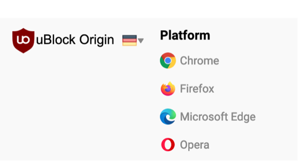

# **Station 2: Werbeblocker installieren**

> "The user decides what web content is acceptable or not in their browser." (uBlock manifesto)
 

Ich empfehle Ihnen, den Blocker uBlock Origin zu verwenden. Ublock Origin ist nicht nur ein Werbeblocker, sondern ein "Wide-spectrum content blocker", der eine ganze Bandbreite von schädlichen und intrusiven Web-Inhalten blockiert. Die blockierten Inhalte können jederzeit manuell zugelassen werden.

uBlock Origin wird als **Addon** für den Web-Browser installiert. Folgende Web-Browser werden unterstützt:

| [Chrome](https://www.google.com/intl/de/chrome/) | [Edge](https://www.microsoft.com/de-de/edge/home?form=MA13FJ) | [Firefox](https://www.mozilla.org/de/firefox/new/) | [Opera](https://www.opera.com/de) |

 

1. Öffnen Sie den gewünschten Browser.

2. Besuchen Sie die Seite: [https://ublockorigin.com/](https://ublockorigin.com/)

3. Scrollen Sie ganz nach unten und klicken Sie auf Ihren Browser

4. Installieren Sie das Browser-Addon und folgen Sie den Anweisungen des Browsers.

5. Öffnen Sie [https://www.youtube.com/](https://www.youtube.com/) und kontrollieren Sie, ob Werbung angezeigt wird.

 

> **Diskussionsfragen:** Ist Werbung blockieren Diebstahl? (wie das immer wieder von 
> im Internet werbetreibenden Unternehmen gesagt wird).