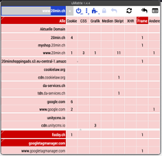
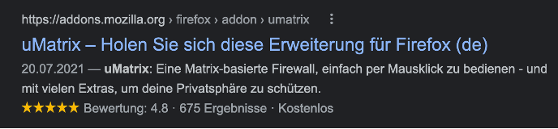

# **Station 3: Das Internet zerstören – und verstehen**

Das Addon uMatrix ist vom gleichen Entwickler wie uBlock Origin und veraltet (Die Möglichkeiten von uMatrix sind heute in uBlock Origin integriert), aber zu Demonstrationszwecken interessant.

Addon uMatrix schlüsselt eine Webseite in alle einzelnen Verbindungen auf, die standardmässig aber blockiert sind und einzeln konfiguriert werden müssen. 

uMatrix zerstört das Internet, wie Sie es sich gewohnt sind. Verwenden Sie also dafür nicht Ihren Standardbrowser.

Installieren Sie zuerst Firefox oder wenn Sie Firefox privat nutzen, Firefox Nightly:

| [Firefox](https://www.mozilla.org/de/firefox/new/) | [Firefox Nightly](https://www.mozilla.org/de/firefox/channel/desktop/) |

1. Öffnen Sie Firefox oder Firefox Nightly

2. Suchen Sie in einer Suchmaschine nach "uMatrix Addon"

3. Installieren Sie das Browser-Addon und folgen Sie den Anweisungen des Browsers.

4. Öffnen Sie [https://www.20min.ch/](https://www.20min.ch/) und probieren Sie aus!