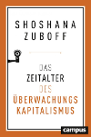
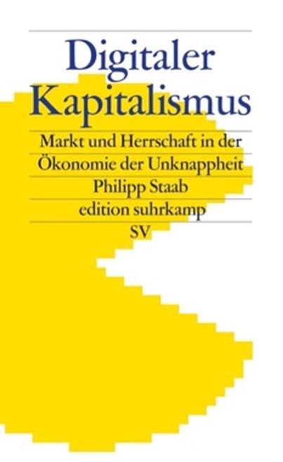

# **Station 5: Spielplatz und Literatur**

### Interessante Tools zur Visualisierung von Tracking im Internet:

**Blacklight:** einfacher Webseiten-Privatsphäre-Inspektor

[https://themarkup.org/blacklight](https://themarkup.org/blacklight)

 

**Trackography:** Tracking geographisch visualisiert

[https://trackography.org/](https://trackography.org/)

 

**Webbkoll:** sehr umfangreicher Webseiten-Privatsphäre-Inspektor

[https://webbkoll.dataskydd.net/de](https://webbkoll.dataskydd.net/de)
 

---

### Zum Ausprobieren: Tor. Der wohl sicherste, aber auch langsamste Browser

[https://www.torproject.org/](https://www.torproject.org/)

Dazu passt: **A beginner's guide to Tor - How to navigate the underground internet**

[https://www.digitaltrends.com/computing/a-beginners-guide-to-tor-how-to-navigate-through-the-underground-internet/](https://www.digitaltrends.com/computing/a-beginners-guide-to-tor-how-to-navigate-through-the-underground-internet/)

 

---

### Literatur

**Online-Ressourcen: Ratgeber für alle**

[https://www.digitale-gesellschaft.ch/ratgeber/](https://www.digitale-gesellschaft.ch/ratgeber/)

[https://digitalcourage.de/digitale-selbstverteidigung](https://digitalcourage.de/digitale-selbstverteidigung)

 

**Wissenschaftliche Studien (technisch)**

Alles von Wolfie Christl. [https://wolfie.crackedlabs.org/](https://wolfie.crackedlabs.org/)

[Bujlow et al. (2017). A Survey on Web Tracking: Mechanisms, Implications, and Defenses.](https://upcommons.upc.edu/bitstream/handle/2117/108437/web_tracking_survey-postprint.pdf)

 

**Buch-Tipps**

- Shoshana Zuboff - Das Zeitalter des Überwachungskapitalismus
- Philipp Staab - Digitaler Kapitalismus

